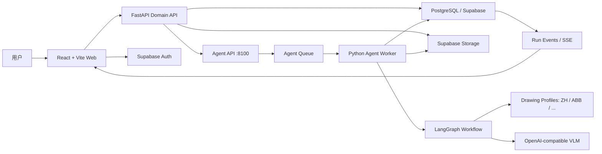

# 线表智能提取系统重构方案

> 状态：Draft for review  
> 日期：2026-10-09  
> 目标技术栈：React + Vite + TypeScript、FastAPI + Python、LangGraph、Supabase、PostgreSQL

## 1. 重构结论

采用渐进式 monorepo 重构，不重写已经验证过的 PDF 渲染和 LangGraph 提取代码。第一阶段先建立新目录、数据库领域模型、认证和项目树；随后将现有 Agent 包装为独立 Worker，并按图纸 Profile 拆出振华、ABB 等模板规则。

核心变化：

- 前端在 `apps/web` 重建为模块化 React + Vite + TypeScript 应用，旧 `frontend/` 保留为迁移期兼容实现；
- `frontend/public/library` 从业务数据源降级为迁移期兼容产物；
- 数据库从单张 `wiring_tables` JSONB 表升级为项目化、可查询、可审计模型；
- FastAPI 从“文件处理接口”改为领域 API，并通过独立 Worker 执行长任务；
- Agent 从振华专用逻辑改为“稳定公共流程 + 可版本化图纸 Profile”；
- XLSX 是派生产物，数据库中的结果版本才是事实来源；
- 用户反馈不会直接改生产 Prompt，而是进入可测试、可审核的规则演进流程。

## 2. 现状与问题

当前原型已经具备：

- PDF 上传、约 300 DPI 拆页；
- 页面分类、当前页扫描、跨页补全；
- Prompt 图片 Few-shot；
- JSON/XLSX 输出、断点文件和测试脚本；
- Supabase Storage 上传和 `wiring_tables` 落库；
- Vite 管理页原型。

主要限制：

1. `job/group/records` 混在一张表中，项目、工作区、图纸没有独立身份。
2. 页面图片和 checkpoint 写在前端 `public` 目录，运行时写入与前端监听冲突。
3. 前端直接聚合 JSONB，无法稳定做分页、检索、权限和行级修订。
4. FastAPI `BackgroundTasks` 不适合小时级任务、进程重启和多 Worker。
5. 默认 Prompt 路径与振华模板绑定，ABB 等模板容易通过条件分支污染公共流程。
6. 缺少用户、权限、结果版本、反馈审计和规则发布机制。

## 3. 目标架构



### 3.1 边界原则

- Web 只负责交互和展示，不持有 service-role key，不执行业务写入。
- API 负责鉴权、领域规则、事务、签名 URL、导出和任务编排。
- 独立 Agent API 使用 `8100` 端口接收异步 run；Worker 负责耗时处理、checkpoint、阶段事件和结果 proposal。
- Graph 只编排稳定阶段，不包含某家图纸的硬编码规则。
- Profile 封装模板识别、Prompt、Few-shot、引用解析、字段策略和校验器。
- PostgreSQL 保存结构化事实；Storage 保存 PDF、图片和阶段产物。完整提取可通过受控 RPC 创建 `draft/needs_review` 结果版本；局部修订不得覆盖原版本，只有用户明确确认后才能通过同一 RPC 创建新 `accepted` 版本。`apps/api` 接入后承担外部鉴权入口。

## 4. Monorepo 目录

目标目录如下，迁移期间旧 `frontend/` 和 `backend/` 暂时保留：

```text
zhenghua/
├─ apps/
│  ├─ web/                         # React + Vite + TypeScript
│  │  ├─ src/apis/                 # API Client、接口函数和 DTO
│  │  ├─ src/assets/               # 样式和静态资源
│  │  ├─ src/components/           # 可复用业务组件
│  │  ├─ src/hooks/                # 复用交互逻辑
│  │  ├─ src/layout/               # 应用布局
│  │  ├─ src/router/               # 路由与守卫
│  │  ├─ src/stores/               # 跨页面状态
│  │  └─ src/views/                # 路由页面
│  └─ api/                         # FastAPI
│     └─ src/
│        ├─ modules/               # auth/projects/workspaces/drawings/runs/wiring/feedback
│        ├─ infrastructure/        # db/storage/queue/vlm adapters
│        └─ main.py
├─ services/
│  ├─ agent/
│  │  ├─ src/
│  │  │  ├─ graph/                 # LangGraph 公共拓扑和 state
│  │  │  ├─ runtime/               # checkpoint/events/retry/idempotency
│  │  │  ├─ profiles/              # profile registry 和协议
│  │  │  └─ validation/            # 公共确定性校验
│  │  ├─ profiles/                 # ZH / ABB / 后续模板版本包
│  │  └─ tests/                    # contract / graph / profile regression
│  └─ server/                      # 领域服务、repository 与基础设施适配器
├─ packages/
│  ├─ ui/                          # 共享 UI 与设计 tokens
│  ├─ api-client/                  # OpenAPI 生成的 TS Client
│  └─ config/                      # ESLint/TS/Tailwind 等共享配置
├─ infra/
│  └─ supabase/                    # migrations、seed、RLS
├─ docs/
├─ scripts/
├─ pnpm-workspace.yaml
├─ pyproject.toml
└─ turbo.json
```

建议使用 `pnpm workspace + Turborepo` 管理 TypeScript 包，Python 使用 `pyproject.toml + uv`。OpenAPI 是前后端接口契约来源，禁止手写两套不一致的 DTO。

## 5. 领域模型与数据库

### 5.1 核心实体

| 实体 | 作用 | 关键字段 |
| --- | --- | --- |
| `profiles` | 用户资料 | `id -> auth.users.id`, `display_name`, `avatar_url` |
| `projects` | 一次 PDF 上传形成的项目 | `owner_id`, `name`, `standard_profile`, `status` |
| `project_members` | 项目权限 | `project_id`, `user_id`, `role` |
| `document_files` | 原始 PDF 与对象存储记录 | `project_id`, `storage_path`, `checksum`, `mime_type` |
| `workspaces` | 项目内工作区 | `project_id`, `code`, `name`, `sort_order` |
| `drawings` | 工作区内图纸页 | `workspace_id`, `pdf_page`, `drawing_page`, `image_path`, `status` |
| `extraction_runs` | 一次可恢复处理运行 | `project_id`, `profile_version`, `status`, `current_stage` |
| `extraction_events` | 阶段事件流 | `run_id`, `seq`, `stage`, `level`, `payload` |
| `wiring_units` | 一个结果版本内的端子排逻辑单元；数据库从 1000 分配线号 | `result_version_id`, `workspace_id`, `drawing_id`, `wire_number`, `voltage_level`, `terminal_strip`, `status` |
| `wiring_connections` | 端子排下的一条芯线/端子明细 | `unit_id`, `principle_number`, `start_code`, `start_description`, `start_terminal`, `end_code`, `end_description`, `end_terminal`, `current_value`, `remark`, `color_mark` |
| `connection_evidence` | 来源与定位证据 | `connection_id`, `drawing_id`, `kind`, `bbox`, `raw_text` |
| `result_versions` | 可导出结果快照 | `project_id`, `run_id`, `version`, `created_by` |
| `feedback_items` | 用户修订与规则建议 | `scope_type`, `scope_id`, `before`, `after`, `status` |
| `profile_versions` | Agent Profile 发布记录 | `profile_key`, `version`, `checksum`, `status` |

### 5.2 数据约束

- `projects.owner_id`、成员关系和所有读取接口必须受 RLS/后端鉴权保护。
- `drawings` 同时保存 PDF 物理页号和图纸业务页号，二者不得混用。
- `wiring_connections` 保存可查询列；VLM 原始响应放 `raw_payload jsonb`，不能只存整包 JSON。
- 一个 `wiring_unit` 对应一个端子排和一个线号，可包含多条 `wiring_connections`；线号由数据库在结果版本内从 `1000` 事务安全递增，不由 Agent 猜测。
- 项目名称、工作区名称和工作区业务页码通过规范化外键维护，并由扁平只读视图提供给 Agent/API 检索；业务页码使用文本，PDF 物理页号单独保存。
- 每条连接必须关联至少一条来源证据，人工录入例外需显式标记来源类型。
- 用户修订使用新版本或审计记录，不直接覆盖且不留痕。
- 旧 `wiring_tables` 在迁移期只读，完成数据回填后删除。

### 5.3 Storage 路径

Bucket 默认改为私有，前端通过短期签名 URL 访问：

```text
projects/{project_id}/original.pdf
projects/{project_id}/workspaces/{workspace_id}/drawings/{drawing_id}.png
projects/{project_id}/runs/{run_id}/stage-1/classification.json
projects/{project_id}/runs/{run_id}/stage-2/page-scan.json
projects/{project_id}/runs/{run_id}/stage-3/cross-page.json
projects/{project_id}/runs/{run_id}/exports/wiring-table.xlsx
```

对象路径只使用不可变 UUID，不使用可改名或可能重复的项目/工作区名称。前端通过数据库中的项目名、工作区名和图纸业务页码展示树形结构，并通过短期签名 URL 读取私有对象。

Checkpoint 写入 Worker 本地 runtime 或专用对象路径，不再写入 Web 的静态目录。

## 6. 前端方案

### 6.1 路由

```text
/login
/projects
/projects/[projectId]
/projects/[projectId]/workspaces/[workspaceId]
/projects/[projectId]/drawings/[drawingId]
/projects/[projectId]/runs/[runId]
```

### 6.2 项目工作台

采用稳定三栏布局：

- Header：品牌、项目切换、运行状态、用户菜单；
- 左侧 280px：项目、工作区、图纸树，支持折叠、状态点和搜索；
- 项目顶部导航：线表工作区、图纸库、规则库；操作区提供 PDF 上传与结果导出；
- 中间 `minmax(0, 1fr)`：结果表格为主，图纸预览和处理过程用 Tabs；
- 跨页引用终点可以悬浮高亮，点击切换到目标图纸并定位目标端子；非跨页终点保持静态；
- 右侧 320px：Supervisor 主 Agent 监工区。初始为空；用户显式开启 Mock 模拟链路并上传 PDF 或提交自然语言需求后，按事件流淡化输出主 Agent 思考，依次显示加粗的 Agent 调度、处理中等待标记、完成勾选、工具结果与错误。模拟仅用于前端演练，不伪装成真实 Agent 运行。

中间区域默认显示线表，不制作营销式首页。表格使用虚拟滚动或服务端分页；固定表头，列宽可调整，点击来源页打开图纸预览。PDF 上传后先登记源文件；Stage 1 完成后才在树中呈现工作区和拆分页，再依次推进后续 Agent。阶段状态由右侧事件流呈现，不重复添加顶部 Validation 进度条。Mock 阶段允许本地事件流和结构化结果 patch；连接后端后切换 API adapter，生产事件仍以数据库和持久化 run 为准。

### 6.3 状态管理

- 服务端数据：TanStack Query；
- 页面状态：URL search params；
- 短期 UI 状态：React state；
- 表单：React Hook Form + Zod；
- 组件：自建薄组件层，可基于 Radix primitives；
- 图标：Lucide；
- 鉴权：Supabase Auth，React Router 路由守卫保护页面，FastAPI 校验 JWT。

### 6.4 事件流

`GET /api/v1/runs/{run_id}/events` 提供 SSE。前端根据事件更新阶段和 Supervisor 监工面板，不再每 2.5 秒重新拉取整个项目。断线后使用 `Last-Event-ID` 续传；最终状态仍以数据库查询为准。当前 Web Mock adapter 还预留 `POST /api/v1/supervisor/runs` 流式入口，待 API/Agent 控制面完成后与其统一事件 DTO 和鉴权契约。

## 7. 后端模块

FastAPI 路由只做协议转换，业务放在 application service：

```text
modules/projects       项目创建、列表、成员权限
modules/imports        上传确认、文件校验、创建处理运行
modules/workspaces     工作区和图纸树查询
modules/runs           启动、取消、续跑、事件流
modules/wiring         表格分页、修订、版本与导出
modules/feedback       数据修订与规则建议
modules/profiles       图纸标准与版本查询
```

建议 API：

```text
POST   /api/v1/projects
POST   /api/v1/projects/{id}/source
GET    /api/v1/projects
GET    /api/v1/projects/{id}/tree
POST   /api/v1/projects/{id}/runs
GET    /api/v1/runs/{id}
GET    /api/v1/runs/{id}/events
POST   /api/v1/runs/{id}/resume
POST   /api/v1/runs/{id}/cancel
GET    /api/v1/projects/{id}/connections
PATCH  /api/v1/connections/{id}
POST   /api/v1/projects/{id}/exports
POST   /api/v1/feedback
```

上传采用“API 创建上传会话 -> 客户端直传 Storage -> API 确认”的方式，避免大 PDF 长时间占用 FastAPI 请求。

## 8. Agent 与多模板设计

### 8.1 公共流程


PDF 渲染、页面索引、跨页任务生成、字段归一化和校验是确定性工作流步骤；三个子 Agent 分别负责页面身份分类、当前页连接扫描和单连接跨页补全。每个阶段只接收完成该任务所需的页面与上下文。ZH 首先通过兼容 Profile adapter 复用现有 `VLMClient`、Prompt、图片 Few-shot 和解析器；新 Agent 不复制或重写旧提取算法。

### 8.2 DrawingProfile 协议

阶段间“提交后从库读取”的改造另见 [ADR-0007](./adr/0007-durable-extraction-stage-boundaries.md) 和 [详细方案](./service/agent/stage-persistence-refactor-plan.md)。该方案尚未实施；现有阶段产物持久化不等于严格的数据库阶段屏障。

每个 Profile 提供：

```python
class DrawingProfile(Protocol):
    key: str
    version: str
    classification_prompt: Path
    page_scan_prompt: Path
    cross_page_prompt: Path
    few_shot_manifest: Path

    def detect(self, document: DocumentContext) -> ProfileMatch: ...
    def resolve_reference(self, ref: ReferenceEvidence, index: DrawingIndex) -> list[DrawingRef]: ...
    def normalize(self, connection: WireConnection) -> WireConnection: ...
    def validate(self, connection: WireConnection) -> list[ValidationIssue]: ...
```

公共 Graph 只调用接口。新增 ABB 时增加 `services/agent/profiles/abb` 和适配器，不修改振华 Prompt，也不在 Graph 节点中写 `if vendor == ...`。

当前文档提取已按 [ADR-0005](./adr/0005-retire-zh-workflow-runtime.md) 拆分：公共 `graphs/document_extraction` 调用注入的 `ExtractionPolicy`；ZH 的端子、方向、电流和引用策略位于 `agent_service.profiles.zh`。PDF/checkpoint/XLSX 位于 `infrastructure/document`，导出字段格式化通过 `ExportFields` 注入。`zh_workflow` 兼容目录已删除，所有 Python 调用直接使用新模块。

### 8.3 反馈闭环

```text
用户修订
-> feedback_items
-> 人工归因（数据问题 / Prompt / 引用解析 / 校验器）
-> 生成候选 Few-shot 或规则版本
-> 固定案例离线回归
-> 人工审核
-> 发布 profile_version
-> 新任务使用，新旧结果可复现
```

模型不得直接修改生产 Prompt。所有 Profile 文件、Few-shot 和校验器必须有版本和 checksum。

Supervisor 阶段 0 的会话边界、短期记忆和检测后人工确认约束见 [ADR-0006](./adr/0006-supervisor-short-term-memory-and-detection-acceptance.md)。该能力只服务类型检测验收，不替代项目级持久任务记忆；长期记忆需后续接入受权限保护的会话 repository。

### 8.4 Supervisor 主 Agent

AI 对话框由一个 Supervisor Agent 负责总揽。它只理解用户意图、请求缺失信息、选择 Profile Detection/Extraction/Correction/Improvement 工作流并转发阶段事件，不亲自执行端子识别，也不直接写生产数据库。

在线局部修订不再使用独立 Remediation Agent。Correction Workflow 根据连接证据和跨页索引确定性选择：直接 patch、Stage 2、Stage 2 + Stage 3 或仅确定性校验。用户接受修订后再异步进入 Improvement，分析模型感知、Prompt/Few-shot、跨页 resolver 或确定性规则问题。

## 9. 可靠性与可观测性

- 使用独立 Agent Worker 和持久队列执行长任务；Celery + Redis 是候选实现，最终选择在实现评审中确定，API 进程重启不得影响任务状态。
- 每个节点以 `run_id + stage + item_id` 作为幂等键。
- checkpoint 使用唯一临时文件、Windows 替换重试和锁，或直接使用数据库/Object Storage。
- 每阶段先写产物，再提交阶段完成事件，避免显示完成但产物不存在。
- 日志包含 `project_id/run_id/profile/stage/drawing_id`。
- VLM 调用保存模型、Prompt 版本、耗时、重试、token/费用（供应商支持时）和响应摘要。
- 不确定结果进入复核队列，流程继续，单页失败不能让整个项目丢失已完成结果。

## 10. 安全

- 浏览器只持有 publishable/anon key，不得出现 service-role key。
- API 验证 Supabase JWT，并在所有查询中强制项目权限。
- Storage 默认私有，使用签名 URL；禁止公开整个 PDF Bucket。
- 上传校验文件类型、大小、PDF 页数和 checksum。
- Prompt、日志和错误响应不得泄漏 API key、JWT 或数据库密钥。
- 导出和用户修改写审计日志。

## 11. 迁移策略

1. 冻结旧 Vite 功能，只修阻断性问题。
2. 建立 monorepo 根配置和 `apps/web`，旧前端继续可运行。
3. 新建规范化表及 RLS，不删除 `wiring_tables`。
4. FastAPI 增加新项目 API，并用适配器调用现有 `wiring_graph.py`。
5. 新 Vite 工作台切换到新 API；右侧 AI 先做静态 UI。
6. 将运行目录迁出 `frontend/public`，接入 Worker 和事件流。
7. 抽取 `DrawingProfile`，先迁移 ZH，再接入 ABB。
8. 回填旧任务数据，核对数量和导出结果后下线旧接口与目录。

每一步都必须可以回退，禁止在新链路通过验收前删除旧代码。

## 12. 验收门槛

- 新用户登录、退出和路由保护正常；
- 上传 PDF 后数据库形成项目、工作区和图纸树；
- 处理事件可实时显示，刷新后可恢复；
- 表格支持服务端分页并可追溯来源图纸；
- XLSX 从指定结果版本生成且行数、顺序和字段一致；
- ZH 固定案例结果不低于当前基线；
- ABB 使用独立 Prompt/Few-shot，并通过独立回归集；
- 用户修订、规则建议和 Profile 发布均有审计记录；
- API、Agent、前端单测和关键端到端测试通过。
