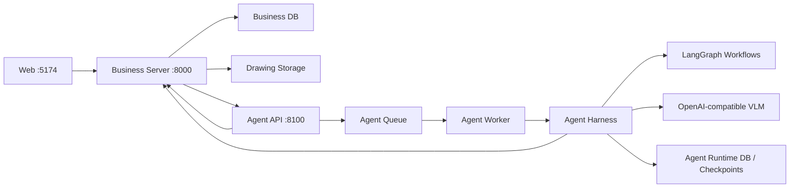

# Agent 服务总体架构

> 状态：Draft  
> 所有者：`services/agent`  
> 默认端口：`8100`

## 1. 目标和非目标

### 目标

- 独立部署并可单独测试，不与业务 Server 共享 Web 进程；
- 自动识别图纸标准，并路由到独立 Profile；
- 保留 ZH 已验证的三阶段提取流程；
- 支持连接、图纸、工作区三个范围的反馈重提取；
- 建立问题归因、候选规则生成、回归评测和人工发布闭环；
- 每次结果都能追溯模型、Profile、Prompt、输入页面和工具轨迹。

### 非目标

- Agent 不管理用户、项目权限和前端会话；
- Agent 不直接覆盖 Server 的生产线表；
- Agent 不根据单次反馈自动发布 Prompt 或代码；
- UNKNOWN 图纸在没有人工确认 Profile 时不进入正式提取；
- V1 不允许 Agent 自由访问数据库、文件系统或任意 HTTP 地址。

## 2. 服务边界



### Server 所有

- 用户、组织、项目与成员权限；
- 原始 PDF、工作区、图纸和页面图片元数据；
- 生产线表、来源证据和结果版本；
- 用户反馈、人工审核结果和导出；
- 向 Web 提供业务 API 和 Agent 事件代理。

### Agent 所有

- Agent run、task、checkpoint 和执行事件；
- Profile 注册表、Prompt/Few-shot/Schema 版本；
- 模型调用轨迹、耗时、重试和费用元数据；
- 局部重提取结果补丁；
- 改进候选、Eval run、指标和发布建议。

两者可以先使用同一个 PostgreSQL 实例，但必须使用不同 schema 和数据库角色：

```text
public / business          Server 写，Agent 只通过工具 API 访问
agent_runtime              Agent run、checkpoint、trace
agent_lab                  候选 Profile、Eval、发布记录
```

## 3. 总体运行模型

Agent 服务暴露控制面 API；耗时任务由 Worker 执行。开发环境可以单进程运行，生产环境拆分为：

```text
agent-api       FastAPI :8100，接收请求、查询状态、输出事件
agent-worker    执行 LangGraph 与 VLM 调用
agent-evaluator 执行离线回归，可独立扩缩容
```

Server 不能同步等待小时级提取。创建 run 后获得 `agent_run_id`，通过事件或回调更新业务任务状态。

## 4. 模块目录

```text
services/agent/
├─ src/agent_service/
│  ├─ api/
│  │  ├─ routes/                   # runs/profiles/feedback/evals/health
│  │  └─ schemas/                  # API Pydantic DTO
│  ├─ application/
│  │  ├─ commands/                 # create/cancel/resume/approve
│  │  ├─ queries/                  # run/event/profile 查询
│  │  └─ orchestrators/            # Graph 选择与生命周期
│  ├─ domain/
│  │  ├─ models/                   # Run、Task、Diagnosis、ResultPatch
│  │  ├─ events/                   # 领域事件
│  │  ├─ policies/                 # 权限、范围、发布门禁
│  │  └─ enums.py
│  ├─ graphs/
│  │  ├─ supervisor/               # 对话主 Agent 与工作流选择
│  │  ├─ profile_detection/        # 图纸类型识别子图
│  │  ├─ extraction/               # 三阶段提取子图
│  │  ├─ correction/               # 反馈局部修订工作流
│  │  └─ improvement/              # 候选改进与评测子图
│  ├─ agents/
│  │  ├─ supervisor.py
│  │  ├─ profile_router.py
│  │  ├─ page_classifier.py
│  │  ├─ page_scanner.py
│  │  ├─ cross_page_resolver.py
│  │  ├─ improvement_diagnoser.py
│  │  ├─ profile_patch_builder.py
│  │  └─ evaluation_judge.py
│  ├─ tools/
│  │  ├─ project_context.py
│  │  ├─ drawing_locator.py
│  │  ├─ evidence_reader.py
│  │  ├─ extraction_runner.py
│  │  ├─ result_diff.py
│  │  ├─ deterministic_validator.py
│  │  ├─ eval_runner.py
│  │  └─ profile_registry.py
│  ├─ harness/
│  │  ├─ model_gateway.py
│  │  ├─ tool_registry.py
│  │  ├─ context_builder.py
│  │  ├─ checkpoint_store.py
│  │  ├─ trace_store.py
│  │  ├─ profile_sandbox.py
│  │  └─ release_gate.py
│  ├─ infrastructure/
│  │  ├─ server_client.py
│  │  ├─ queue.py
│  │  ├─ persistence.py
│  │  ├─ storage.py
│  │  └─ telemetry.py
│  └─ main.py
├─ profiles/
│  ├─ zh/
│  │  ├─ profile.yaml
│  │  ├─ prompts/
│  │  ├─ examples/
│  │  ├─ schemas/
│  │  ├─ validators/
│  │  └─ evals/
│  └─ abb/
├─ tests/
│  ├─ unit/
│  ├─ integration/
│  ├─ contract/
│  └─ profile_regression/
├─ pyproject.toml
└─ README.md
```

Profile 资产最终迁入 `services/agent/profiles/<profile>`。迁移前仍从 `backend/app/prompts` 读取，通过 Compatibility Adapter 保持现有案例可运行。

## 5. Agent 协作模型

不是所有节点都需要 LLM。确定性代码负责路由、索引、校验、diff、版本和持久化；专用 Agent 只负责必须理解图纸或自然语言反馈的部分。

| Agent | 输入 | 输出 | 工具权限 |
| --- | --- | --- | --- |
| Supervisor | 用户消息、会话上下文、业务对象摘要 | 意图、追问、Workflow Command、用户事件 | 只读业务摘要、Workflow Registry |
| Profile Router | PDF 物理首页、动态识别规则 | Profile 候选与置信度 | 只读首页、Profile Registry |
| Page Classifier | 单页图纸、Profile | 工作区、业务页号、页面类型 | 无业务写权限 |
| Page Scanner | 当前页、Profile | 同页记录和跨页引用 | 图纸读取、Schema |
| Cross-page Resolver | 来源页、目标页、单条任务 | 终点补全 | 定向页面读取 |
| Improvement Diagnoser | 已接受修订、旧轨迹、新旧 diff | 离线根因分类与证据 | accepted feedback、trace/eval 只读 |
| Profile Patch Builder | 聚合问题、Profile 副本 | 候选 Prompt/Few-shot/规则补丁 | 只写沙箱 |
| Evaluation Judge | 候选与评测指标 | 发布建议 | 只读指标，不可发布 |

发布动作不是 LLM Agent，必须由 `ReleaseGate` 确定性策略和人工审批共同完成。

## 6. Graph 划分

### 6.0 Supervisor Graph

```text
receive_user_turn
-> resolve_conversation_and_permissions
-> classify_intent
-> request_missing_input | dispatch_workflow
-> relay_child_events
-> present_proposal_or_result
```

Supervisor 是唯一用户交互入口，但不替代可靠工作流。长任务状态由 Run/Event/Checkpoint 保存；Supervisor 只持有当前回合需要的最小上下文。

### 6.1 Profile Detection Graph

```text
render_pdf_first_page
-> load_profile_detection_rules
-> profile_router_agent
-> deterministic_result_validation
-> PROFILE_SELECTED | WAITING_INPUT
-> user_confirmation_if_required
-> lock_profile_snapshot
```

M4 只读取 PDF 物理首页，不扫描后续页面。Router 将所有已注册 Profile 的结构化识别规则动态注入同一次 VLM 请求，输出 `profile_key`、版本、首页证据、置信度、候选项和原因。识别不到、候选无效、低置信或 Profile 尚处于 experimental 时进入 `WAITING_INPUT`，由用户选择并确认；只有生成不可变 ProfileBinding 后才允许进入 Extraction Graph。

Profile 同时提供前端可读取的公开规则摘要。三阶段 Extraction Graph 拓扑和最终 Connection Schema 保持统一，ZH/ABB 差异通过锁定的 Profile 动态注入 Prompt、Few-shot、引用解析、端子规则、normalizer 和 validator，不在公共 Graph 中增加供应商分支。

### 6.2 Extraction Graph

```text
load_profile
-> render_or_load_pages
-> Stage 1 classify pages
-> build drawing index
-> Stage 2 scan each source page
-> deterministic normalize
-> build cross-page tasks
-> Stage 3 resolve each connection
-> deterministic validate/diff
-> emit ResultProposal
```

ZH 当前三阶段逻辑迁为第一个 Profile Subgraph。Stage 2 和 Stage 3 保持单条连接身份、来源页和证据，不能跨任务修改其他记录。

Stage 1/2/3 子 Agent 各有独立的 Pydantic 请求/结果和可单独调用的 LangGraph 子图：

- `PageClassifierAgent`：输入单页渲染图与已锁定 Profile，输出 PDF 物理页号、工作区和图纸业务页号。
- `PageScannerAgent`：只接收当前来源页；不接受目标页图片，跨页终点保持为空并保留引用证据。
- `CrossPageResolverAgent`：接收一条确定性索引任务、来源页和目标页；输出模型没有 `start` 字段，只能补终点。
- Drawing Index、跨页任务构建、结果合并和业务校验不属于 VLM Agent，由确定性工作流节点负责。

当前 ZH 通过 `LegacyZhStageAdapter` 调用原 `VLMClient` 的 `classify_page`、`scan_page`、`resolve_cross_page`。因此现有 Prompt、图像 Few-shot、解析器及重试策略继续生效；新阶段 Agent 不复制提取算法。Stage Graph 由后续 Extraction Workflow 串联，ABB 在拥有独立可用 adapter 前不能分派到这些 ZH 兼容调用。

### 6.3 Correction Workflow

```text
load_feedback_target
-> retrieve_original_trace_and_pages
-> deterministic_correction_route
-> direct_patch | scoped_stage_replay
-> compare_old_new
-> deterministic_validation
-> human_review_if_needed
-> ResultPatchProposal
```

Correction Workflow 不包含独立 Remediation Agent。是否跨页、可否直接 patch、应重跑 Stage 1/2/3 或只跑确定性节点，均由持久化索引、反馈类型和固定矩阵决定。视觉重提取复用 Page Scanner/Cross-page Resolver。

### 6.4 Improvement Graph

```text
aggregate_accepted_feedback
-> cluster_failure_signatures
-> issue_diagnoser_agent
-> create_profile_sandbox
-> profile_patch_builder_agent
-> build_eval_dataset
-> run_candidate_and_baseline
-> evaluation_judge_agent
-> deterministic_release_gate
-> human_approval
-> canary_publish_or_reject
```

## 7. DrawingProfile

Profile 必须是版本化包，而不是三个 Markdown 文件：

```python
class DrawingProfile(Protocol):
    key: str
    version: str

    def signatures(self) -> list[ProfileSignature]: ...
    def prompts(self) -> PromptBundle: ...
    def few_shots(self) -> FewShotManifest: ...
    def classify_schema(self) -> type[BaseModel]: ...
    def extraction_schema(self) -> type[BaseModel]: ...
    def resolve_reference(self, ref: ReferenceEvidence, index: DrawingIndex) -> list[DrawingRef]: ...
    def normalize(self, record: WireConnection) -> WireConnection: ...
    def validate(self, record: WireConnection) -> list[ValidationIssue]: ...
    def eval_suite(self) -> EvalSuite: ...
```

当前 `backend/app/prompts/abb` 中存在与 ZH 同名、同案例结构的资产，不能仅凭目录存在就宣称 ABB 已支持。ABB Profile 上线前必须使用独立 ABB 原图、圆圈放线标志规则和回归集验证。

## 8. Harness 组成

### Model Gateway

- 兼容 OpenAI 格式；
- 统一模型、超时、重试、并发、token 和费用记录；
- 每个 Agent 可选择不同模型，但必须记录模型快照；
- 禁止业务节点直接创建裸 `httpx` Client。

### Tool Registry

- 每个 Agent 只有明确 allowlist；
- Tool 输入输出使用 Pydantic；
- 所有读写带 `project_id/run_id/scope`；
- 写工具默认生成 proposal，不直接提交生产数据；
- 用户反馈作为不可信数据，不能被解释为系统指令。

### Context Builder

- 只加载当前 scope 所需页面、记录、引用和规则；
- 对图片数量和上下文大小设预算；
- 保存完整 Context Manifest，保证重放。

### Checkpoint 与 Trace

- 每个节点以 `run_id + graph + node + item_id` 幂等；
- checkpoint 存 Agent runtime，不写前端目录；
- trace 保存输入引用、Prompt/Profile/模型版本、工具调用、Schema 结果和错误；
- 大图片只保存对象引用和 checksum，不重复写数据库。

### Profile Sandbox 与 Release Gate

- 候选只能修改 Profile 副本；
- 所有补丁保存 diff、生成原因和关联反馈；
- 回归不过、成本超限或保护案例下降时自动拒绝；
- 人工审核后先 canary，再全量发布；
- 支持一键回滚到前一个不可变版本。

## 9. 独立部署与配置

建议配置：

```env
AGENT_HOST=0.0.0.0
AGENT_PORT=8100
AGENT_ENV=development
AGENT_SERVER_BASE_URL=http://127.0.0.1:8000
AGENT_INTERNAL_TOKEN=...
AGENT_DATABASE_URL=postgresql://.../agent_runtime
AGENT_PROFILE_ROOT=services/agent/profiles
AGENT_CHECKPOINT_BACKEND=postgres
AGENT_QUEUE_URL=redis://127.0.0.1:6379/1
AGENT_MODEL_BASE_URL=...
AGENT_MODEL_API_KEY=...
AGENT_DEFAULT_MODEL=...
AGENT_ENABLE_IMPROVEMENT=false
```

探活接口：

```text
GET /health/live   进程存活
GET /health/ready  数据库、队列、Profile Registry、模型配置就绪
```

本地目标启动方式：

```powershell
uv run uvicorn agent_service.main:app --app-dir services/agent/src `
  --host 0.0.0.0 --port 8100
```

## 10. 可靠性与安全

- Server-Agent 请求使用内部服务身份、短期令牌或 mTLS；
- 每次创建 run 强制 `Idempotency-Key`；
- Agent 只接受 Storage 签名 URL 或受控对象引用；
- Tool 不接受任意路径、任意 SQL、任意 URL；
- 同一 `target_id + expected_version` 同时只允许一个 correction run；
- 取消任务在页面循环、模型调用和发布边界检查；
- Agent 失败只返回失败事件，不修改当前生产结果；
- 所有结果提交都由 Server 再次执行 Pydantic、业务约束和乐观锁校验。

## 11. 迁移顺序

1. 建立 `services/agent` FastAPI 壳层、健康检查和 run API。
2. 用 Compatibility Adapter 包装当前 `backend/app/agents/wiring_graph.py`。
3. 迁移 ZH Profile，运行固定回归集并对比现有输出。
4. 将 checkpoint 和事件迁入 Agent runtime。
5. 接入 Server 内部工具 API 和结果 proposal/commit。
6. 实现 Profile Detection Graph。
7. 实现 Supervisor 主 Agent 和 Correction Workflow。
8. 建立 Eval Harness，再开放 Improvement Graph。
9. 使用独立 ABB 样本完成 ABB Profile，最后移除 Compatibility Adapter。

## 12. 验收

- Agent 在 `8100` 独立启动，Server 停止时仍能探活并明确显示依赖未就绪；
- ZH 全量和局部重跑均支持断点续跑；
- Profile 误判和低置信能停在人工确认点；
- 单条反馈不触发整个 PDF 重跑；
- 新结果以 patch + diff 返回，未批准前不影响生产版本；
- 改进候选不能直接写 production Profile；
- Profile 发布可追溯关联反馈、评测和审批人；
- 同一输入、Profile、模型快照和 Context Manifest 可复现执行。
