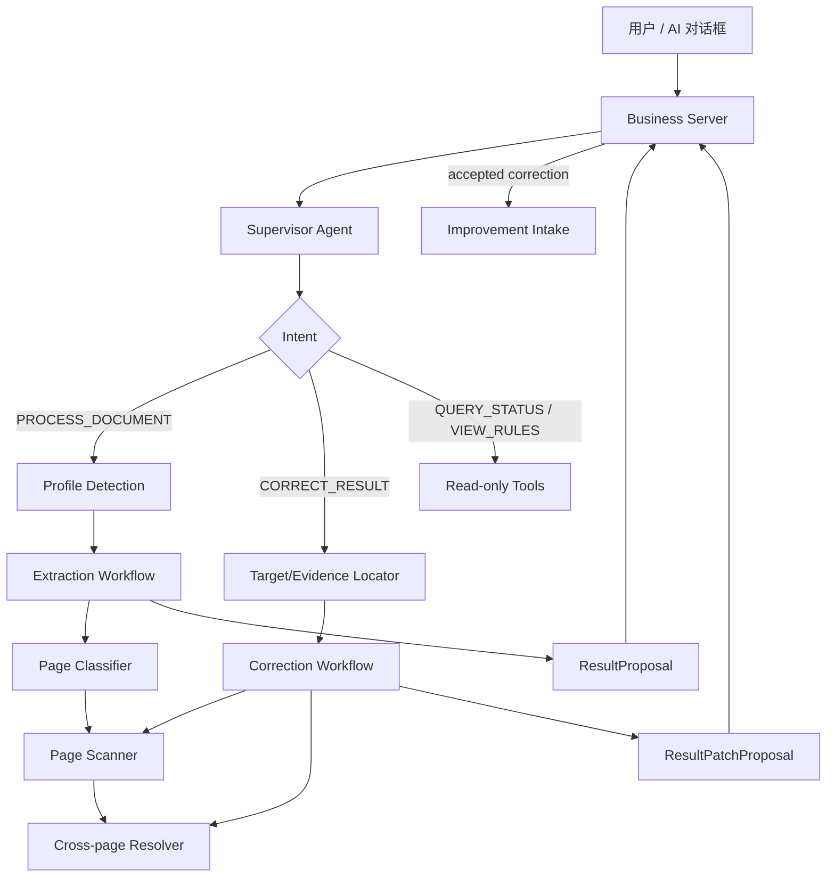

# Supervisor 主 Agent 与工作流

> 状态：Architecture baseline  
> 日期：2026-10-08

## 1. 结论

系统只有一个面向用户的 Agent：`SupervisorAgent`。Profile Router、Page Classifier、Page Scanner、Cross-page Resolver 和 Improvement 相关 Agent 都是内部专业子 Agent，不直接维护用户会话。

Supervisor 不亲自识别图纸，也不直接写生产数据库。它负责：

- 理解用户是在处理 PDF、修改线表、查询状态还是查看规则；
- 将模糊自然语言转换成结构化 Command；
- 缺少项目、连接或 Profile 时返回 `WAITING_INPUT`；
- 启动 Extraction、Correction 或 Improvement Workflow；
- 将子工作流事件转换为用户可读的实时消息；
- 收集用户确认，并把确认后的 Command 重新交给对应工作流；
- 只接收 ResultProposal/ResultPatchProposal，由业务 Server 完成生产提交。

## 2. 总体链路



## 3. 用户意图

```text
PROCESS_DOCUMENT   上传或处理一份 PDF
CORRECT_RESULT     修改、复核某条线、线号、图纸或工作区
QUERY_STATUS       查询处理进度、错误或阶段结果
VIEW_RULES         查看当前 Profile 和提取规则
CONFIRM_INPUT      回答 Profile、范围或修改确认问题
UNKNOWN            无法安全理解，需要追问
```

意图识别只产生结构化 `SupervisorDecision`。用户文本是不可信输入，不能改变工具权限、Profile 文件或系统 Prompt。

## 4. 处理 PDF

```text
Supervisor
-> Profile Detection（只读物理首页）
-> PROFILE_SELECTED | WAITING_INPUT
-> 锁定 ProfileBinding
-> Extraction Workflow
   -> PDF render tool
   -> Page Classifier
   -> Page Scanner
   -> build cross-page tasks
   -> Cross-page Resolver
   -> deterministic validation
-> ResultProposal
-> Server commit
```

Supervisor 在逻辑上总揽流程，但 Stage 1/2/3 的可靠顺序由 Extraction Workflow 保证。子 Agent 每完成一个 item/stage 都发事件，Supervisor 负责转发，不由聊天模型临时决定下一页如何执行。

## 5. 修改线表

修改目标必须先通过 `project_id + result_version_id + connection_id` 定位。线号、工作区和页码只用于搜索和上下文，不能作为唯一键。

确定性 Correction Router 按证据分流：

| 场景 | 执行动作 |
| --- | --- |
| 用户明确直接改值 | 生成 before/after patch，不调用 VLM |
| 同页连接识别错误 | 目标 Drawing 的 Stage 2 + validator |
| 跨页连接错误 | Stage 2 引用复核 + 重建 task + 单连接 Stage 3 + validator |
| 起点漏提 | 目标 Drawing Stage 2；新增跨页连接再执行 Stage 3 |
| 排序、格式、去重 | 只运行确定性 normalizer/mapper/validator |
| 工作区/业务页错误 | 受影响页 Stage 1，再执行相关 Stage 2/3 |
| 图纸没有证据 | 返回 `SOURCE_INSUFFICIENT`，不重复猜测 |

因此删除独立 `RemediationAgent`、`FeedbackTriageAgent` 和 `RemediationPlannerAgent`。其能力分别归属：

- Supervisor：理解用户意图、追问和确定业务目标；
- Locator Tools：读取连接、来源证据、阶段产物和 Profile 快照；
- Correction Router：根据持久化索引和反馈类型选择固定路径；
- Stage 2/3 子 Agent：执行局部视觉重提取；
- Diff/Validator：生成受限 ResultPatchProposal。

## 6. Improvement 触发

Correction 完成不代表立即修改规则。只有 ResultPatchProposal 被用户接受并由 Server 创建新结果版本后，Server 才向 Improvement Intake 发事件。

Improvement Diagnoser 再判断：

```text
MODEL_PERCEPTION_ERROR
PROMPT_RULE_GAP
FEW_SHOT_GAP
CROSS_PAGE_RESOLUTION_ERROR
DETERMINISTIC_RULE_ERROR
SCHEMA_MAPPING_ERROR
PROFILE_ROUTING_ERROR
SOURCE_INSUFFICIENT
TRANSIENT_MODEL_ERROR
```

单个案例默认只进入回归集。候选规则仍需 baseline/candidate 回归、Release Gate 和人工批准。

## 7. 事件与会话

长任务状态必须持久化为 Run/Event/Checkpoint，不存放在 Supervisor 的模型上下文中。Supervisor 向聊天界面输出的消息由结构化事件派生：

```json
{
  "conversation_id": "conversation-uuid",
  "agent_run_id": "run-uuid",
  "event_type": "STAGE_COMPLETED",
  "stage": "PAGE_SCAN",
  "user_message": "当前页扫描完成：35/120 页，已生成 86 条连接，3 条待复核。",
  "requires_input": false
}
```

Web 只连接业务 Server。Server 校验用户权限、保存会话、代理 Agent 事件，并通过 SSE/WebSocket 推送；Web 不直接持有 Agent 内部凭证。

## 8. 模块边界

```text
agents/supervisor.py                 自然语言意图与追问
agents/profile_router.py             首页 Profile 识别
agents/page_classifier.py            Stage 1
agents/page_scanner.py               Stage 2
agents/cross_page_resolver.py        Stage 3
agents/improvement_diagnoser.py      已接受反馈的离线归因

graphs/supervisor/                    对话回合和工作流选择
graphs/profile_detection/             Profile 检测
graphs/extraction/                    完整提取
graphs/correction/                    局部修订
graphs/improvement/                   候选规则与评测

tools/target_locator.py               连接/线号/工作区定位
tools/evidence_reader.py              原图与阶段证据
tools/correction_router.py            确定性最小重跑矩阵
tools/result_diff.py                  字段级 diff
```

